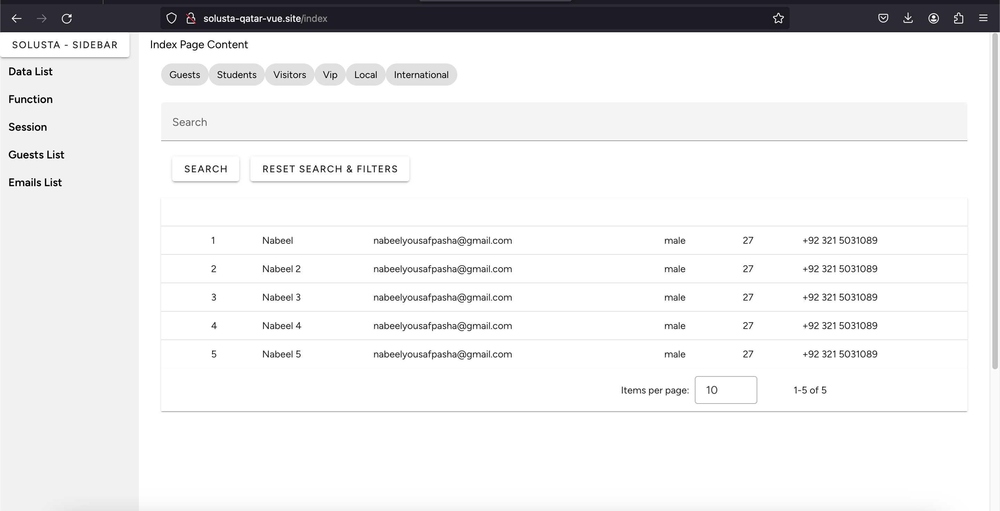
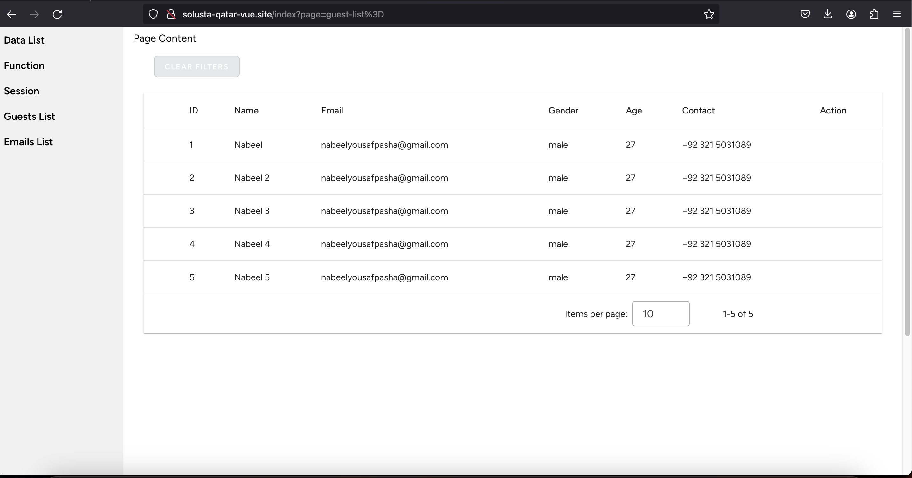

# <u> Solusta Qatar - Nabeel Pasha </u>

## <u> Requirements </u>
| Tech    |   Version   |
|---------|:-----------:|
| PHP     |  `>= 8.2`   |
| NODE    | `>= v20.x`  |
| NPM     |  `>= 10.x`  |

## Technology Stack
<ul>
    <li>Vue 3 (Composition API)</li>
    <li>Pinia (State Management)</li>
    <li>MySQL</li>
    <li>PHP</li>
</ul>

## Setup Guide
```
git clone git@github.com:NabeelYousafPasha/solusta-qatar-vue.git

cd solusta-qatar-vue

composer install (for laravel, inertiajs vue3)

npm install

npm run dev
```

## Project Main Features

### Custom Table Component

#### File: 
`resources/js/Components/Custom/Table.vue`

#### Route: 
`/index`

#### V2 (Filters, Search Bar, 3 dots action if row is selected)


#### V1 (Basic)


### Pinia Store

For `light/dark` theme and dynamic `sidebar` toggle state

#### File(S): 
`resources/js/stores/*`

#### Components
`Index.vue` resources/js/Pages/Index.vue

we can mock data from MySQL via APIs but for `Solusta technical evaluation`, 
I'm using hardcoded `array of objects` 

### NOTE: 
due to shortage of time as per personal availabilites, grey strucutre and psuedo 
code is used as well in some cases
